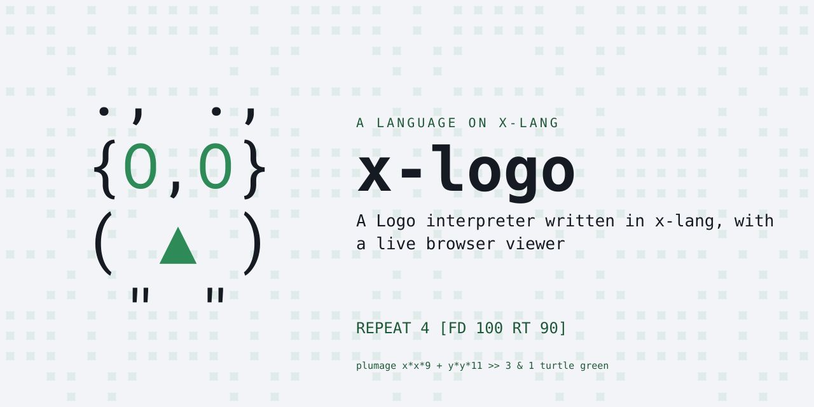
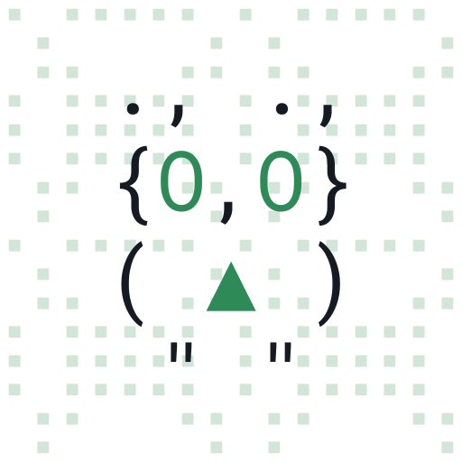

# x-logo — Logo turtle graphics for x-lang

<p align="center"></p>

A Logo interpreter written in [x-lang](https://github.com/jonruttan/x-lang), with a
live browser viewer — roughly
2,400 lines implementing a second surface language, complete with its own
tokenizer types, an infix expression parser, an HTTP server and an animated
SVG turtle. It is the worked demonstration of the claim that whole surface
languages load on top of a dialect.

It lived in x-lang's `apps/logo/` until it became a bundle. Nothing about the
language changed in the move; what changed is that it is now acquired,
pinned, and tested against a matrix of platform releases like every other
lang — see [The Lang Contract](https://github.com/jonruttan/x-lang/blob/main/docs/lang-contract.md).

## Install

```sh
x --install-lang https://github.com/jonruttan/x-logo/releases/latest/download/lang.pin.xon
x -l logo
```

That fetches the published pin, then the tarball it names, digests it, and
installs to `<install-root>/langs/logo` — the stable name `-l` resolves.

**Or pin it, for one project.** An install is unversioned and machine-wide; a
pin freezes a specific verified tarball for a single build. Put the
`lang.pin.xon` from a release in your project and `(Pin bundle "deps")`.

**Or from a clone**, which is what you want while working on it:

```sh
make install          # into the x on PATH
X_LANG_DIR=.. x -l logo    # or skip installing: run the tree in front of you
```

## Quick Start

```sh
x -l logo                 # or: rlwrap x -l logo, for line editing
x -l logo -f prog.logo    # batch: run the program, write the bytecode, no server
```

The interactive form opens a REPL and serves the viewer at
`http://localhost:8080`. Type Logo commands and watch the turtle draw in the
browser.

Chapter-1 programs from *Turtle Geometry* are in
[`examples/ch1.logo`](examples/ch1.logo); load one with the `LOAD` command
described under [File Loading](#file-loading).

## Requirements

**x-lang v0.9.0 or later**, declared in [`lang.xon`](lang.xon) and enforced by
the release pairing rather than by hope. The floor has teeth: this bundle
reads `%lang-root` to find `logo/viewer.html`, and that seam row does not
exist in earlier platforms — against one, the viewer request raises on an
unbound symbol rather than degrading.

**radon**, and that is read off the imports rather than chosen: `x/sys/socket`
serves the viewer, `x/sys/file` backs the bytecode stream and `LOAD`, and
`x/sys/posix` supplies the fork/kill/wait that runs the server as a child.
Those are radon opt-ins, so Logo is a radon lang whatever else it might prefer
to be.

## Commands

### Movement
| Command | Args | Description |
|---------|------|-------------|
| `FORWARD` / `FD` | distance | Move forward |
| `BACK` / `BK` | distance | Move backward |
| `RIGHT` / `RT` | degrees | Turn clockwise |
| `LEFT` / `LT` | degrees | Turn counterclockwise |
| `SETXY` | x y | Move to absolute position |
| `SETX` | x | Set x coordinate |
| `SETY` | y | Set y coordinate |
| `HOME` | | Return to origin, heading 0 |
| `SETHEADING` / `SETH` | degrees | Set absolute heading |

### Pen
| Command | Args | Description |
|---------|------|-------------|
| `PENUP` / `PU` | | Stop drawing |
| `PENDOWN` / `PD` | | Resume drawing |
| `PENCOLOR` / `PC` | color | Set pen color (`"red"`, `"#FF0000"`) |
| `PENWIDTH` / `PW` | width | Set line width |

### Screen
| Command | Args | Description |
|---------|------|-------------|
| `CLEARSCREEN` / `CS` | | Clear and reset |
| `HIDETURTLE` / `HT` | | Hide cursor |
| `SHOWTURTLE` / `ST` | | Show cursor |

### Queries
| Function | Returns |
|----------|---------|
| `HEADING` | Current heading (degrees) |
| `XCOR` | Current x position |
| `YCOR` | Current y position |
| `DISTANCE(x, y)` | Distance to point |
| `TOWARDS(x, y)` | Heading toward point |
| `TURTLE.STATE` | Position + heading as list |

### Scaled Turtle
| Command | Args | Description |
|---------|------|-------------|
| `GROW` | factor | Multiply scale by factor |
| `S.FORWARD` / `S.FD` | distance | Forward * current scale |

## Control Flow

```logo
REPEAT 4 [ FD 100 RT 90 ]

REPEAT FOREVER [ FD 1 RT 1 ]

REPEAT [ FD 10 X <- X + 1 ] UNTIL X > 100

IF X > 5 THEN FD 100
IF X > 5 THEN FD 100 ELSE BK 50
IF NOT X < 0 THEN FD 100

IF X > 5 THEN
    FD 100
    RT 90

TO SQUARE SIZE
    REPEAT 4
        FD SIZE
        RT 90

TO POLY SIDE ANGLE [ FD SIDE RT ANGLE POLY SIDE ANGLE ]

STOP                    ; exit current procedure
RETURN expr             ; return value from procedure
```

## Expressions

Infix arithmetic with standard precedence:

```logo
FD 2 + 3 * 4            ; = 14
FD (2 + 3) * 4          ; = 20
X <- SIDE + 1
POLYSPI (SIDE + 1, ANGLE)
```

Operators: `+` `-` `*` `/` `^` `=` `>` `<` `>=` `<=` `<>`

## Math Functions

```logo
SQRT(144)               ; 12
ABS(-7)                 ; 7
SIN(90)                 ; 1
COS(0)                  ; 1
TAN(45)                 ; 1
ARCTAN(1)               ; 45
REMAINDER(17, 5)        ; 2
RAND(1, 100)            ; random integer
ROUND(3.7)              ; 4
INT(3.9)                ; 3
POWER(2, 10)            ; 1024
PI                      ; 3.14159...
NOT(expr)               ; boolean negation
MEMBER(item, [list])    ; list membership
```

## Variables

```logo
X <- 10                 ; assignment
X <- X + 1              ; update
PRINT X                 ; output value
TYPE X                  ; output without newline
```

## File Loading

```logo
LOAD "examples/ch1.logo"
```

## Meta-evaluation

```logo
EXECUTE "fd 100 rt 90"
```

## Examples

### Square
```logo
REPEAT 4 [ FD 100 RT 90 ]
```

### Circle
```logo
REPEAT 360 [ FD 1 RT 1 ]
```

### Spiral
```logo
TO POLYSPI SIDE ANGLE
    FD SIDE
    RT ANGLE
    POLYSPI (SIDE + 1, ANGLE)
```

### Flower
```logo
TO ARCR R DEG [ REPEAT DEG [ FD R RT 1 ] ]
TO PETAL SIZE [ ARCR SIZE 60 RT 120 ARCR SIZE 60 RT 120 ]
TO FLOWER SIZE [ REPEAT 6 [ PETAL SIZE RT 60 ] ]
FLOWER 60
```

### Spirolateral
```logo
TO SPIRO SIDE ANGLE MAX
    REPEAT FOREVER
        COUNT <- 1
        REPEAT MAX
            FD SIDE * COUNT
            RT ANGLE
            COUNT <- COUNT + 1
```

### GCD (Euclid's Algorithm)
```logo
TO EUCLID N R
    IF N = R THEN RETURN N
    IF N > R THEN RETURN EUCLID(N - R, R)
    IF N < R THEN RETURN EUCLID(N, R - N)

PRINT EUCLID(360, 144)    ; 72
```

## Browser Viewer

The viewer at `http://localhost:8080` shows the turtle drawing in real time.

- **Play/Pause** — control animation playback
- **Reset** — restart animation from the beginning
- **Speed slider** — 1 (slow) to 200 (instant)

The viewer receives a bytecode stream from the REPL. Each turtle command emits compact opcodes (`F`, `R`, `L`, `U`, `D`, `K`, `W`, etc.) that the browser interprets and renders as SVG.

### Static Embedding

For blog posts, embed bytecodes directly:

```html
<script>
window.TURTLE_BC = ["F",100,"R",90,"F",100,"R",90,"F",100,"R",90,"F",100,"R",90];
</script>
<script src="turtle-player.js"></script>
```

> **Note:** `turtle-player.js` is not shipped in this repository — the
> standalone player was never split out of `viewer.html`. Until it is, static
> embedding means extracting the `parseBytecode`/render logic from
> `viewer.html` by hand.

## Architecture

```
Logo REPL (x-lang)                    Browser (viewer.html)
  |                                      |
  |-- turtle commands                    |
  |     (fd, rt, pencolor, ...)          |
  |                                      |
  v                                      |
  state.x -- bytecode emission           |
  |     ("F",100  "R",90  "K","red")     |
  |                                      |
  v                                      |
  serve.x -- /bc endpoint ---------> poll every 100ms
  |     (JSON array of bytecodes)        |
  |                                      v
  |                               parseBytecode()
  |                               compute positions
  |                               render SVG lines
  |                               animate cursor
```

## Layout

```
lang.xon                 what this bundle is: name, dialect, release pairing
run.x                    the entry
logo/                    the language
examples/ch1.logo        Turtle Geometry chapter 1, with its .expect
tests/specs/             the spec suite
tests/tty/               expect scripts, for what only a terminal shows
tools/check/             the release-refs gate, sourced from x-lang's lang kit
```

No file here carries a path literal, `run.x` included — x.sh boots the dialect
`lang.xon` declares and arms this root *before* `run.x` is read, so nothing
needs one. That is what the extraction from `apps/logo/` was mostly about: an
in-tree app may self-boot and address the tree around it, and a bundle may do
neither.

### Source files

| File | Lines | Description |
|------|------:|-------------|
| `logo/dispatch.x` | 480 | Command dispatcher and control flow |
| `logo/types.x` | 405 | Logo tokenizer types |
| `logo/entry.x` | 257 | Line entry: brackets, cancellation, EOF |
| `logo/expr.x` | 193 | Expression parser (infix to values) |
| `logo/serve.x` | 183 | HTTP server for the browser viewer |
| `logo/repl.x` | 150 | Interactive REPL |
| `logo/tstate.x` | 128 | Extended turtle commands |
| `logo/state.x` | 126 | Turtle state and bytecode emission |
| `logo/indent.x` | 73 | Indentation preprocessor |
| `logo/math.x` | 66 | Math functions and LFSR random |
| `logo/main.x` | 59 | Server setup, hooks, fork |
| `run.x` | 48 | The entry `lang.xon` names |
| `logo/json.x` | 39 | Bytecode JSON output |
| `logo/turtle.x` | 38 | Turtle command surface |
| `logo/viewer.html` | 489 | Browser viewer and animation |

## Testing

```sh
make test        # the turtle specs
make examples    # every example, against its pinned output
make tty         # the interactive contract (needs expect(1))
```

All three take `X=` to name a particular x — `X=../x-lang/x.sh make test` runs
against a checkout instead of the installed platform, which is what you want
when the change under test is in the platform.

**Three suites, because they see different things.** The specs drive the
turtle kernel through a generated harness: no reader, no dispatcher, no
server. The examples run whole Logo programs end to end, which is the only
thing that exercises the indentation preprocessor, the tokenizer, the infix
parser and the batch launcher together. The tty tests drive a real pty,
because ctrl-c cancellation, the exit paths and the execute-once ruling are
`isatty`-guarded and therefore invisible to both of the others — they shipped
broken once for exactly that reason.

**The spec suite is heavy.** The turtle kernel's resident heap runs 5–7 GB,
which is what its `@weight 7` row is for. Run it on a quiet machine: two of
these at once is a swapping machine, and a swapping machine reports failures
that are not there.

**There is no `known-failures.txt`, and that is a claim rather than an
omission.** The suite is green. A bundle carrying documented debt needs a
ratchet so the debt cannot grow quietly; a bundle with none wants the runner's
own verdict, so that the first new failure is red on the day it lands.

## Background

Logo began in 1967 at BBN with Wally Feurzeig, Seymour Papert and Cynthia
Solomon: Lisp's ideas — lists, words, procedures, recursion — in a language
children could think in. The turtle arrived a couple of years later, first as
a floor robot and then on screen, and became the language's signature: geometry
you learn by *being* the thing that draws it. Papert's *Mindstorms* (1980) is
the book-length argument for why that matters.

This implementation follows *Turtle Geometry: The Computer as a Medium for
Exploring Mathematics* by Harold Abelson and Andrea diSessa (MIT Press, 1981)
— the chapter-1 programs in [`examples/ch1.logo`](examples/ch1.logo) are that
book's, and the scaled-turtle commands exist because its exercises ask for
them.

- [Logo Foundation](https://el.media.mit.edu/logo-foundation/) — history, and the language's people
- [*Computer Science Logo Style*](https://web.archive.org/web/2023/https://people.eecs.berkeley.edu/~bh/logo.html) — Brian Harvey's three volumes (archived; the Berkeley host answers unreliably)
- [*Turtle Geometry*](https://archive.org/details/mit_press_book_9780262362740) — the book this bundle is an instrument for reading, open access at the Internet Archive

## Licence

MIT No Attribution (MIT-0). See [LICENSE](LICENSE).

<p align="center"></p>
